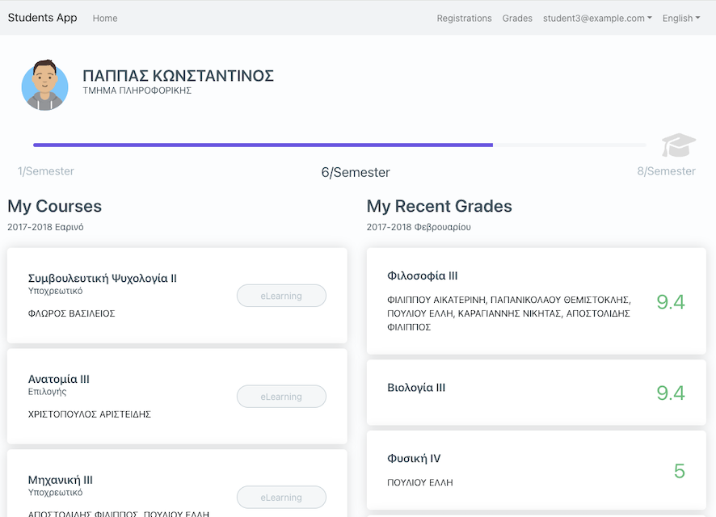

## @universis/react-students-starter

An alternative of [@universis/students](https://gitlab.com/universis/universis-students) for React

### Usage

Clone repository

    git clone https://gitlab.com/universis/react-students-starter

install dependencies

    yarn install

and start application

    npm start

### Features

- Login/ Logout
- View student progress
- View registered courses
- View latest grades
- Change language